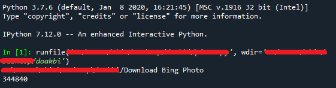
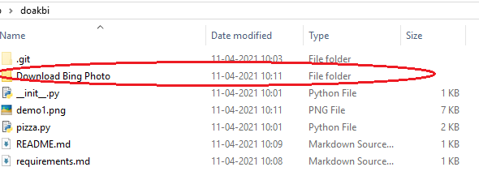
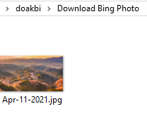

#  doakbi
This program can download the photo of the front page of Bing site, by crawling in the HTML code of the site and getting the required information.
------------------------------------------------------
### Check the [Requirements](requirements.md) File before executing the code
------------------------------------------------------
### If the Libraries are not not installed then check the [Installation](Installation.md) File.
-------------------------------------------------------
## Demo:
- When you run the code on your terminal you will get something like this:
- 
- A new folder gets created where your file is kept:
- 
- Open that Folder to find the Picture:
- 
-------------------------------------------------------

